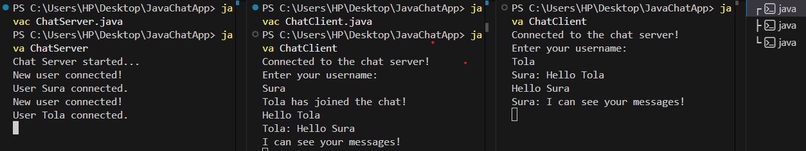

# Real-Time Multi-User Chat Application

## 📌 Project Overview
This project is a CLI (Command Line Interface) based chat application developed in **Java**. It utilizes the **Client-Server Architecture** to allow multiple users to connect to a centralized server and exchange messages in real-time. The application is built using Java’s networking libraries (`java.net`) and handles concurrent users using **Multithreading**.

## 🚀 Key Technologies Used
*   **Language:** Java (JDK 17+)
*   **Networking:** Java Sockets (`Socket`, `ServerSocket`)
*   **Concurrency:** Java Threads (`Thread`, `Runnable`)
*   **I/O Handling:** `BufferedReader` and `PrintWriter`
*   **IDE:** Visual Studio Code

## 📂 Project Structure
*   `ChatServer.java`: The centralized server that listens for connections and broadcasts messages.
*   `ChatClient.java`: The client application that allows users to send and receive messages.

## ⚙️ How It Works
1.  **The Server** starts on port `12345` and waits for connections.
2.  **Clients** connect to the server using TCP/IP.
3.  The server spawns a new **Thread** for each client to handle multiple users simultaneously.
4.  Messages sent by one user are **broadcasted** to all other connected users.
## 📷 Output Screenshot

